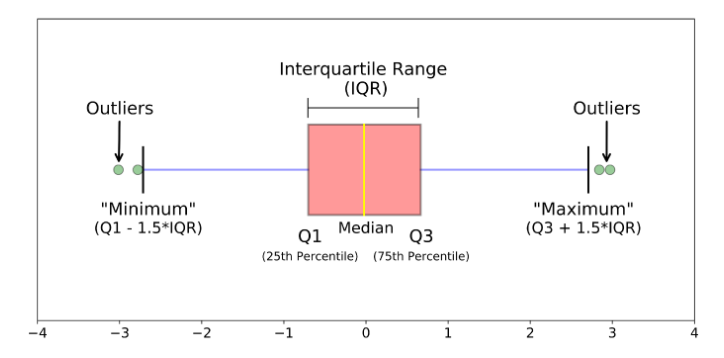

```{r setup, include=FALSE}
knitr::opts_chunk$set(echo = TRUE,
                      fig.align = "center",
                      dpi = 300,
                      fig.retina = 2,
                      warning = FALSE,
                      message = FALSE)
```

```{r packages}
library(heplots)
library(tidyverse)
library(patchwork)
library(ADati)
```

# FAQ

## $\eta^2$ e $\eta^2_p$ (parziale)

La differenza tra $\eta^2$ e $\eta^2_p$ consiste principalmente del denominatore della formula. Nel primo caso la formula prevede:

$$
\eta^2 = \frac{SS_{effect}}{SS_{total}}
$$
Dove $SS$ è la somma dei quadrati (*sum of squares*) ovvero la devianza. Questo viene intepretato come la variabilità spiegata da un certo effetto. Un $\eta^2$ di 0.13 indica che un dato effetto spiega il 13% della variabilità totale. Proviamo a calcolarlo:

```{r}
# Creiamo dei dati fake per un disegno fattoriale 2x2
dat <- expand.grid(
    n = 1:10,
    x1 = c("a", "b"),
    x2 = c("c", "d", "e")
)
dat$y <- rnorm(nrow(dat)) # variabile dipendente
head(dat)
```

Ora fittiamo il modello:

```{r}
fit <- lm(y ~ x1 * x2, data = dat)
fita <- data.frame(anova(fit))
fita
```

In questo caso abbiamo 3 effetti, il main effect di `x1`, il main effect di `x2` e l'interazione `x1:x2`. Se vogliamo calcolare $\eta^2$ dobbiamo dividere la `Sum Sq` di ogni effetto per il totale:

```{r}
fita$Sum.Sq[1:3] / sum(fita$Sum.Sq) # ogni effetto diviso il totale
heplots::etasq(fit, partial = FALSE)
```

L'$\eta^2_p$ invece:

$$
\eta^2_p = \frac{SS_{effect}}{SS_{effect} + SS_{error}}
$$
Possiamo calcolarlo quindi:

```{r}
fita$Sum.Sq[1:3] / (fita$Sum.Sq[1:3] + fita$Sum.Sq[4]) # ogni effetto diviso il totale
heplots::etasq(fit, partial = TRUE)
```

Dal punto di vista dell'utilizzo, la differenza principale riguarda comparare diversi studi. Come scrive Lakens (2013)^[https://www.frontiersin.org/articles/10.3389/fpsyg.2013.00863/full]:

> Although $\eta^2$ is an efficient way to compare the sizes of effects within a study (given that every effect is interpreted in relation to the total variance, all $\eta^2$ from a single study sum to 100%), eta squared cannot easily be compared between studies, because the total variability in a study ($SS_{total}$) depends on the design of a study, and increases when additional variables are manipulated. Keppel (1991) has recommended partial eta squared ($\eta^2_p$) to improve the comparability of effect sizes between studies, which expresses the sum of squares of the effect in relation to the sum of squares of the effect and the sum of squares of the error associated with the effect. 

## Esercizi - Inferenza

Per questi esercizi è molto utile avere chiaro il funzionamento delle varie distribuzioni di probabilità implementate in R e delle loro funzioni associate. Ad esempio in R ci sono varie distribuzioni:

- `norm`: La distribuzione normale
- `t`: la distribuzione t di student
- `binom`: la distribuzione binomiale

Per ognuna di queste distirbuzioni ci sono le funzioni per calcolare varie proprietà o generare dati:

- `r`: genera dati da una distribuzione e.g. `rnorm()`
- `d`: calcola la densità di probabilità
- `p`: calcola la probabilità cumulata dato un quantile
- `q`: calcola il quantile associato ad una data probabilità cumulata

Quando sappiamo i parametri che definiscono una distribuzione (e.g. *media* e *deviazione standard* per la distribuzione normale) possiamo utilizzare tutte queste funzioni:

```{r}
# genero 10 valori da una normale con media = 0 e sd = 1
rnorm(n = 10, mean = 0, sd = 1)

# calcolo la densità del valore 0
dnorm(x = 0, mean = 0, sd = 1)

# calcolo la probabilità cumulata fino al valore 0
pnorm(q = 0, mean = 0, sd = 1)

# calcolo il valore associato alla probabilità cumulata di 0.5
qnorm(p = 0.5, mean = 0, sd = 1)
```

## Esercizio 3.2

Una cosa utile è visualizzare la distribuzione di verosimiglianza (likelihood). Ad esempio nel caso della binomiale, definita per i parametri $p$ (probabilità di successo) e $n$ (numero di eventi) posso visualizzare la distribuzione usando `dbinom()`:

```{r}
nlanci <- 12
nsuccessi <- 0:12 # tutti i possibili successi
p <- 0.5
lik <- dbinom(nsuccessi, nlanci, p)
plot(lik, type = "h")
points(lik, pch = 19)
```

Se cambiamo il parametro $p$ vediamo che la distribuzione sarà differente:

```{r}
p <- 0.2
lik <- dbinom(nsuccessi, nlanci, p)
plot(lik, type = "h")
points(lik, pch = 19)
```

Nel caso in cui volessimo testare se una moneta è bilanciata (il lancio della moneta si modella come una distribuzione binomiale) ovvero $p_{testa} = 0.5$:

- eseguiamo un esperimento: lanciamo 12 volte la moneta
- registriamo il numero di teste
- prendiamo una *decisione*

La *decisione* ma sopratutto la *soglia decisionale* è assolutamente arbitraria. La soglia decisionale, meglio nota come $\alpha$ permette di fissare una soglia per la quale ci prendiamo il *rischio* di rifiutare l'ipotesi nulla.

Ad esempio:

- se su 12 lanci ottengo 10 teste, la moneta è bilanciata?
- se su 12 lanci ottengo 6 teste, la moneta è bilanciata?

Possiamo quindi calcolare la probabilità di ottenere un certo numero di teste o un numero di teste più estremo:

```{r}
# probabilità di ottenere 10 o più teste su 12 lanci se la probabilità di testa è 0.5
pbinom(q = 10, size = 12, prob = 0.5, lower.tail = FALSE)
```

Come vedete, questo valore (che voi conoscete come *p-value*) ci permette di dire che ottenere 10 o più teste è *altamente improbabile* (ma non impossibile).
Prendendo $\alpha = 0.05$, ogni volta che il nostro p-value è minore di $\alpha$ ci prendiamo il rischio di rifiutare l'ipotesi nulla, sapendo che possiamo sbagliarci $\alpha$ percento di volte ripetendo l'esperimento un numero elevato di volte.

Vediamo il tutto usando la funzione `binom.test()`:

```{r}
binom.test(x = 10, n = 12, p = 0.5, alternative = "greater")
```

## Esercizio 3.3

Lo stesso principio si può applicare a qualsiasi test statistico come il `t-test` o lo `z-test`.

```{r}
esami <- scan("../data/esame.txt")

# calcolo media ed standard error
se <- sd(esami)/sqrt(length(esami))
mean_x <- mean(esami)

# distribuzione campionaria della media
curve(dnorm(x, 18, se), 12, 20)
points(mean_x, 0, col = "red")
```

A questo punto, posso calcolare la probabilità di ottenere un risultato minore o uguale a $\bar x$ usando la funzione `pnorm()` (esattamente come prima con `pbinom()`):

```{r}
pnorm(q = mean_x, mean = 18, sd = se)
```

Come vedete è estremamente bassa, e ci suggerisce che il nostro risultato è altamente improbabile se la media vera da cui è stato estratto il nostro campione è 18.

Se vogliamo fare formalmente il nostro test, possiamo usare la funzione `t-test` (ad 1 campione):

```{r}
t.test(esami, mu = 18, alternative = "less")
```

Il `t-test` si basa sulla statistica `t` calcolata nel caso ad un campione come:

$$
t = \frac{\bar x - x_{pop}}{\frac{\sigma_x}{\sqrt{n_x}}}
$$
Come per la media, possiamo visualizzare la distribuzione campionaria della statistica $t$ che viene definita in base ai gradi di libertà ($df = n_x - 1$)

```{r}
curve(dt(x, df = length(esami) - 1), -4,4)
```

Come vedete il nostro `t` osservato dal t-test molto improbabile considerando l'ipotesi nulla ed infatti il `p-value` è estremamente piccolo.

## Ricodificare variabile

Quando abbaimo un dataframe spesso è utile ricodificare i valori di una colonna in base ad alcune condizioni logiche. Ad esempio, ricodificare l'età in base alla fascia (e.g. maggiore e minore di 18). Per fare questo ci sono diverse funzioni e approcchi:

### `ifelse()`

La funzione `ifelse()` permette di eseguire del codice in modo **condizionale** ovvero in funzione ad una condione logica che quindi restituisce valori `TRUE` e `FALSE`.

Generiamo delle età casuali:

```{r}
age <- round(runif(30, 15, 70))
age
```

Ora vogliamo creare un vettore di lunghezza `r length(age)` con la stringa "minorenne" se il valore di `age` è minore di 18 anni e maggiorenne se il valore è maggiore o uguale a 18:

```{r}
# test = condizione da testare
# yes = cosa deve succedere se test è TRUE
# no = cosa deve succedere se test è FALSE

ifelse(test = age < 18, yes = "minorenne", no = "maggiorenne")
```

Se vogliamo più di una condizione possiamo usare più `ifelse()`, uno dentro l'altro:

```{r}
ifelse(age < 18,
       yes = "minorenne",
       no = ifelse(age > 18 & age < 60, 
                   yes = "adulto", 
                   no = "anziano"))
```

### `case_when()`

Questa funzione può essere utile quando abbiamo tante condizioni. Indicativamente con più di 3 condizioni scrivere tanti `ifelse()` può essere scomodo. In questo caso possiamo usare la funzione `case_when()` dal pacchetto `dplyr`. La sintassi è strana ma molto intuitiva: `test ~ valore` e possiamo mettere più `test` chiaramente separati da una virgola

```{r}
dplyr::case_when(
    age < 18 ~ "minorenne",
    age >= 18 & age < 60 ~ "adulto",
    age >= 60 ~ "anziano"
    # ...altre condizioni
)
```

## 1.12

Leggiamo i dati:

```{r}
dat <- readxl::read_xls(path = "../data/pazienti.xls")
```

Vediamo i quartili:

```{r}
# con summary ci vengono già calcolati
summary(dat$ansia)
```

Il 2 quartile è in realtà la mediana, quindi possiamo calcolarlo con la funzione `median()`:

```{r}
median(dat$ansia) # 2 quartile
```

Il modo più generale e versatile però è usare la funzione `quantile()` che permette di ottenere qualsiasi quantile e non solo i quartili. Otteniamo il 25, 50 e 75 percentile ovvero il primo, secondo e terzo quartile:

```{r}
quantile(dat$ansia, probs = c(0.25, 0.5, 0.75))
```

Possiamo ottenere i quantili anche per variabili ordinali. Prima però dobbiamo dire ad R che le etichette della variabile sono in realtà in ordine:

```{r}
# fattore normale
factor(dat$cl.sociale)

# fattore ordinato
ordered(dat$cl.sociale, levels = c("Bassa", "Media", "Alta"))

# fattore ordinato usando il comando factor
factor(dat$cl.sociale,
       levels = c("Bassa", "Media", "Alta"),
       ordered = TRUE)
```

Per ottenere i quantili poi dobbiamo cambiare il tipo di algoritmo, in particolare il `type = 1`:

```{r}
cl_sociale_ord <- ordered(dat$cl.sociale, levels = c("Bassa", "Media", "Alta"))

quantile(cl_sociale_ord, probs = c(0.25, 0.5, 0.75), type = 1)
```

Ogni volta che avete un dubbio, leggete la documentazione delle funzioni R ed i messaggi di errore/warning. In questo caso sono molto utili per capire cosa dobbiamo fare:

```{r, error=TRUE}
# fattore non ordinato
cl_sociale_fac <- factor(dat$cl.sociale)
quantile(cl_sociale_fac, probs = c(0.25, 0.5, 0.75))
```

Il rango percentile invece è la percentuale di valori minori o uguali ad un dato valore $x_i$. Quindi può essere visto come "speculare" al percentile. Facciamo un esempio con la mediana:

- il rango percentile della mediana è 50% (o 0.5)
- mentre il valore associato al 50% rango percentile è la mediana

Con la funzione `quantile()` noi chiediamo quale valore è associato ad un certo rango percentile (argomento `probs = `) mentre se calcoliamo manualmente la quantità di valori uguali o inferiori ad un dato valore allora stiamo calcolando il rango percentile.

Ad esempio, calcoliamo il rango percentile di 39 (magari ci sono funzioni che lo fanno già direttamente):

```{r}
sort(dat$eta) # ordinare
mean(sort(dat$eta) <= 39)
```

Lo stesso principio si può usare con distribuzioni teoriche le quali sono già implementate in R. Tutte le distribuzioni disponibili hanno le funzioni `d`, `p`, `q`, `r` che permettono di calcolare o generare dati. Ad esempio:

```{r}
curve(dnorm(x, mean = 0, sd = 1), -4, 4)
```

il rango percentile (la percentuale/probabilità cumulata) si calcola con il comando `p`. Nel caso della normale:

```{r}
# q = quantile su cui calcolare il rango percentile
# mean = media della distribuzione normale
# sd = deviazione standard della distribuzione normale

pnorm(q = 0, mean = 0, sd = 1)
```

il quantile associato ad un certo rango percentile si calcola con il comando `q`:

```{r}
# p = probabilità comulata associata ad un certo quantile (aka rango percentile)
# mean = media della distribuzione normale
# sd = deviazione standard della distribuzione normale

qnorm(p = 0.5, mean = 0, sd = 1)
```

## Varianza, devianza e deviazione standard

La varianza e la deviazione standard sono 2 indici di dispersione molto utilizzati perchè indicano quanto i valori di una distribuzione di dati sono dispersi rispetto alla media.

Per capire è utile scomporre le formule. La devianza $SS$ è la somma degli scarti alla media. Gli scarti sono le differenze di ogni valore della distribuzione dalla sua media (si utilizza $n - 1$ quando si stima la varianza campionaria mentre solo $n$ per la varianza della popolazione) 

$$
SS = \sum_{i = 1}^n (x_i - \bar x)^2
$$

La varianza $\sigma^2$ è la media degli scarti dalla media. Quindi è semplicemente la devianza divisa per il numero di elementi:

$$
\sigma^2 = \frac{\sum_{i = 1}^n (x_i - \bar x)^2}{n - 1} = \frac{SS}{n-1}
$$
La deviazione standard infine non è altro che la radice quadrata della varianza.

In R possiamo calcolarle con le funzioni `var()` e `sd()` e la devianza semplicemente adattando la formula:

```{r}
# devianza. somma degli scarti dalla media al quadrata
SS <- sum((dat$eta - mean(dat$eta))^2)
SS

# varianza 
SS / (length(dat$eta) - 1)
var(dat$eta)

# deviazione standard
sqrt(SS / (length(dat$eta) - 1))
sd(dat$eta)
```

## Moda

La **moda** invece è l'elemento/i di una distribuzione associato/i alla frequenza massima. Al contrario di media e mediana ci possono essere più mode. In questo caso la distribuzione viene definita multimodale.

Vediamo la distribuzione:

```{r}
barplot(table(dat$eta)) # visualizziamo le 4 mode
```

Vediamo se corrispondono:

```{r}
ADati::moda(dat$cl.sociale)
ADati::moda(dat$eta)
```

## Boxplot

Il boxplot è una delle rappresentazioni grafiche più semplici ma potenti che ci siano. Fornisce tante informazioni su una distribuzione di valori numerici come:

- i quartili
- lo scarto interquartile ($IRQ$)
- eventuali outlier

```{r, fig.cap="Elementi principali di un Boxplot. Fonte https://towardsdatascience.com/understanding-boxplots-5e2df7bcbd51", out.width="100%", echo = FALSE}

```

La scatola contiene il 50% della distribuzione (ovvero la differenza tra il 3° e il 2° quartile). La linea all'interno della scatola è la mediana mentre i due estremi sono il "minimo" ed il "massimo" intesi però come $1.5\;IRQ$ ovvero una volta e mezza lo scarto interquartile. Gli outlier sono quindi valori che sono più grandi o più piccoli di una volta e mezza lo scarto interquartile.

Possiamo crearlo con il comando `boxplot()`:

```{r}
boxplot(dat$ansia)
```

Un trucco per capire intuitivamente il boxplot è immaginarlo come un istogramma dall'alto. Infatti come l'istogramma ci da un'idea della forma della distribuzione ma con molte più informazioni:

```{r}
histp <- ggplot(dat) +
    geom_histogram(aes(x = ansia),
                   bins = 30,
                   fill = "lightblue", 
                   col = "black")
boxp <- ggplot(dat) +
    geom_boxplot(aes(x = ansia),
                 fill = "lightblue", 
                 col = "black")
boxp / histp # patchwork
```


